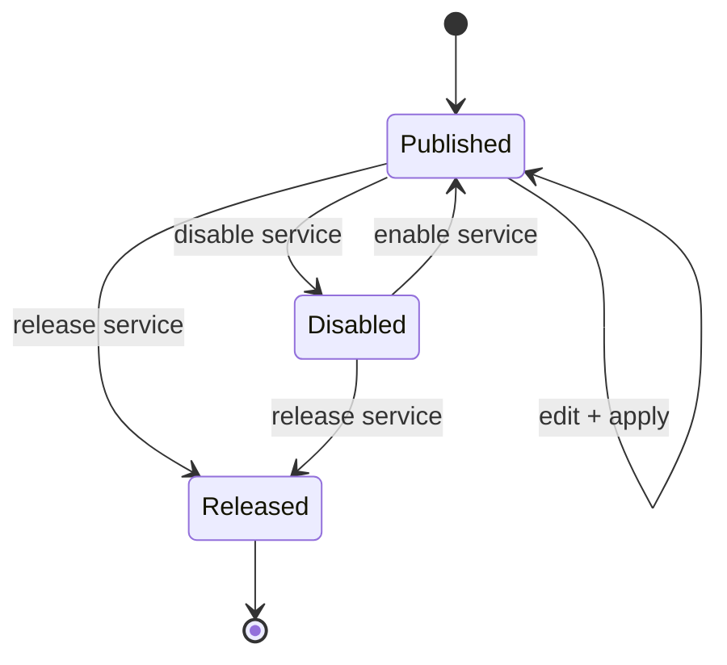
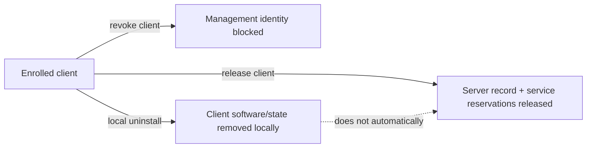
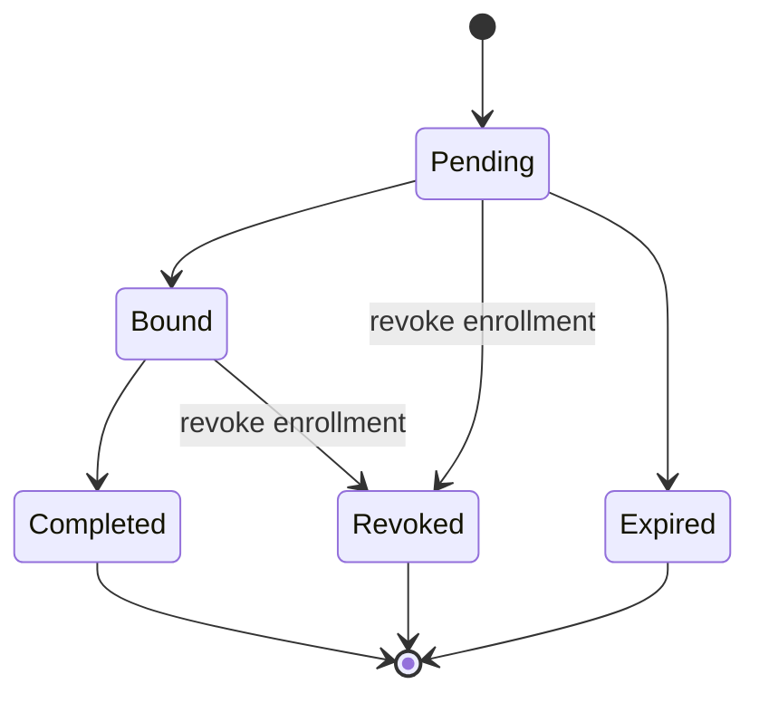
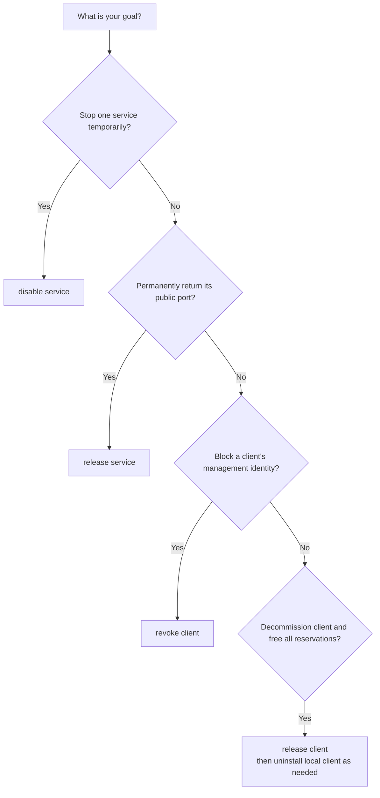

# Lifecycle Semantics

DataRelay Link deliberately separates **temporary publication**, **management identity**, and **public-port reservation**. These are different state machines.

```text
disable   != release
revoke    != release
uninstall != release
update    != re-enrollment
```

## Service lifecycle



| Action | Effect | Public port |
| --- | --- | --- |
| Disable service | stop publication temporarily | **kept** |
| Enable service | resume publication | **same port reused** |
| Edit + apply | change target/name/config | **kept when possible** |
| Release service | remove reservation | **returned to pool** |

## Client management lifecycle



- `revoke client` blocks the client's management identity but does not mean "free all public ports".
- `release client` is the server-side operation that removes the client record and returns its service reservations.
- client uninstall is local-only and does not automatically contact the server to release reservations.

There is intentionally no ambiguous `delete client` command.

## Enrollment credential lifecycle — stable v2.2.1



`show enrollments` does not expose the secret itself. Stable v2.2.1 supports revoking active enrollment credentials with:

```bash
sudo drlink revoke enrollment <ID>
```

<Note>
  The stable v2.2.1 CLI includes the qualified enrollment lifecycle/retention controls. Mutable `main` may contain later changes, so field procedures should follow the immutable v2.2.1 contract.
</Note>

## Which command do I actually want?



## Update

A supported normal project update is not a re-enrollment operation. Identity, CA, token, registry, and persistent public ports are designed to remain intact.

<Warning>
  Do not use `release` as a generic cleanup command unless you actually intend to return the public-port reservation to the pool.
</Warning>
