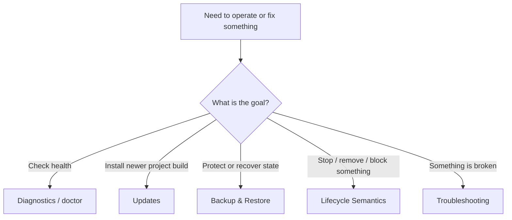
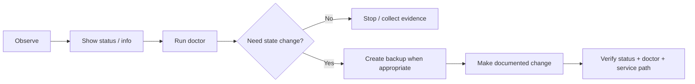

# Operations Overview

Use this page as the operator map after deployment.



<CardGroup cols={2}>
  <Card title="Diagnostics" icon="stethoscope" href="/operations/diagnostics">
    Start with read-only status and `doctor` before changing generated state.
  </Card>

  <Card title="Updates" icon="arrows-rotate" href="/operations/updates">
    Update the project or bundled relay engine without intentionally losing identity, CA, token, or ports.
  </Card>

  <Card title="Backup & Restore" icon="box-archive" href="/operations/backup-restore">
    Protect and recover trust, registry, configuration, and port reservations.
  </Card>

  <Card title="Lifecycle" icon="diagram-project" href="/operations/lifecycle">
    Choose disable, revoke, release, uninstall, or another operation without confusing their effects.
  </Card>

  <Card title="Troubleshooting" icon="triangle-exclamation" href="/troubleshooting/overview">
    Follow a symptom-driven decision tree for enrollment, tunnel, port, DNS, and certificate problems.
  </Card>

  <Card title="Release Status" icon="tag" href="/reference/release-status">
    Distinguish the immutable stable v2.2.1 release from later mutable `main` changes.
  </Card>
</CardGroup>

## Safe operating sequence



## State DataRelay Link tries to preserve

Normal supported updates and reboots are designed to preserve:

- CLIENT ID and management identity
- project private CA
- DataRelay Link token
- server registry
- service definitions
- persistent public-port reservations

## Avoid destructive debugging

Do not begin troubleshooting by manually editing:

```text
/etc/data-relay-link/relay-server.toml
/etc/data-relay-link/relay-client.toml
/var/lib/data-relay-link/registry.json
/etc/data-relay-link/client-state.json
management identity / PKI files
```

Use `drlink doctor` first and follow the documented lifecycle command for the actual intent.

<Tip>
  If you are unsure whether you mean **disable**, **revoke**, or **release**, read [Lifecycle Semantics](/operations/lifecycle) before executing the command.
</Tip>
