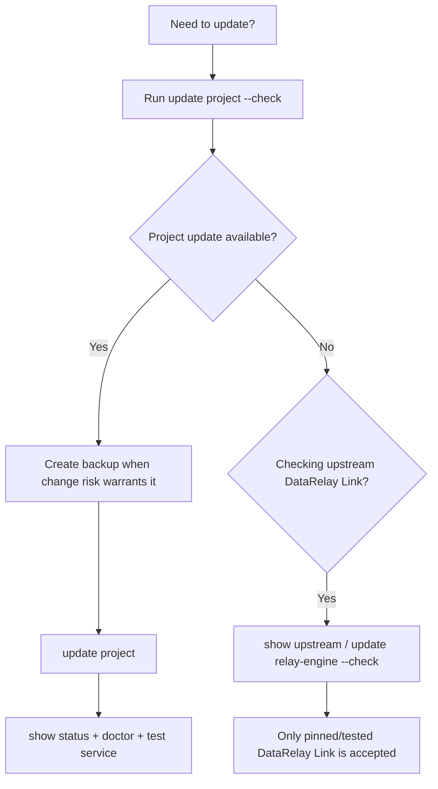
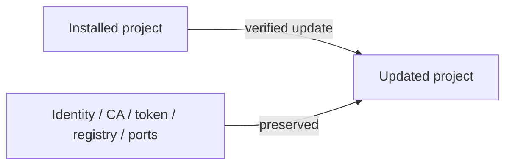
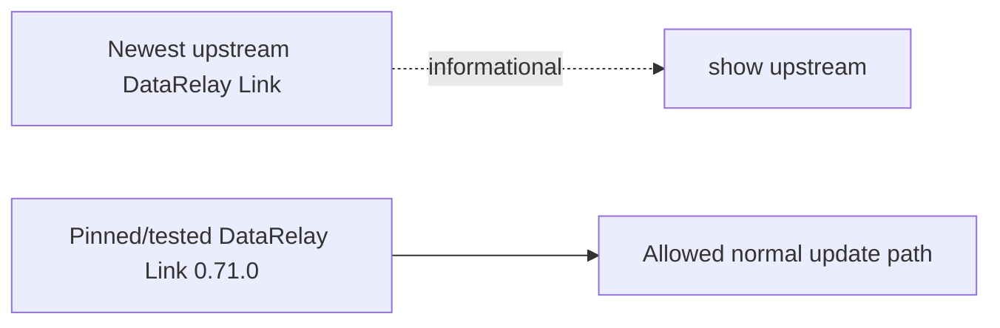

# Updates

DataRelay Link separates **project updates** from **upstream DataRelay Link binary updates**.

## Update decision flow



## Project update

Check first:

```bash
sudo drlink update project --check
```

Then update:

```bash
sudo drlink update project
```

A normal supported project update is designed to preserve:

- CLIENT ID and client management identity
- project private CA
- DataRelay Link token
- registry state
- enrollment state where applicable
- service definitions
- persistent public service-port reservations



A normal update is **not** a re-enrollment operation.

## Stable release vs development `main`

| Channel | Meaning | Recommended use |
| --- | --- | --- |
| **v2.2.1 immutable tag** | current published stable | field/normal installation |
| **main** | mutable development/docs channel | intentional development/testing only |

Do not copy a development-only command into stable field documentation unless the operator explicitly opted into development behavior.

## DataRelay Link binary update

```bash
sudo drlink show upstream
sudo drlink update relay-engine --check
```

`show upstream` is informational. DataRelay Link does **not** automatically install the newest upstream DataRelay Link release. The current stable release remains pinned to the qualified version, **v0.71.0**.



## Same-version refreshes

Update decisions are not based only on the visible project version string. Verified release metadata and bundle SHA256 can distinguish changed builds even when the project version text is unchanged.

## After any update

```bash
sudo drlink show version
sudo drlink show status
sudo drlink doctor
```

Then test at least one representative published service through its public endpoint.

<Warning>
  Do not manually replace the bundled relay-server/client runtimes with arbitrary newer upstream binaries just because `show upstream` reports one. The tested/pinned relay-engine policy is part of release safety.
</Warning>
