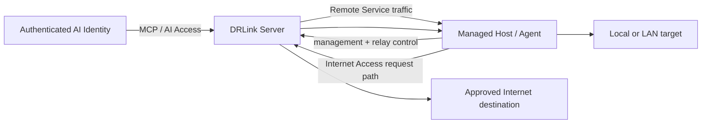

# Architecture

## Roles



## Server control plane

The Server owns enrollment, Managed Host inventory, Network/Service/Permission Objects and Groups, AI Identities, Access Policies, revisions, audit, backup/restore, and Server ConfigurationBundle.

## Agent plane

The Agent owns local lifecycle and Remote Services. A Remote Service binds one destination to one Service Object and receives a stable DataRelay Link endpoint.

## Policy planes

Remote Access, Internet Access, and AI Access are separate policy families with the same BLACKLIST/WHITELIST plus Enforcement model. Rules are unordered and carry no per-rule ALLOW/DENY action.

## Authoritative state

The v2.4 target uses SQLite as authoritative Server state:

```text
/var/lib/drlink/drlink.db
```

Runtime configuration is compiled from authoritative state. JSON compatibility files from older releases are not a second source of truth.

## Trust boundaries

Enrollment bootstrap credentials, persistent Agent management identity, Relay Engine transport credentials, and AI OAuth credentials are distinct. One credential must not be treated as another.

MCP is a server-side authenticated bridge. It does not bypass AI Access policy, Agent identity, or target OS permissions.
