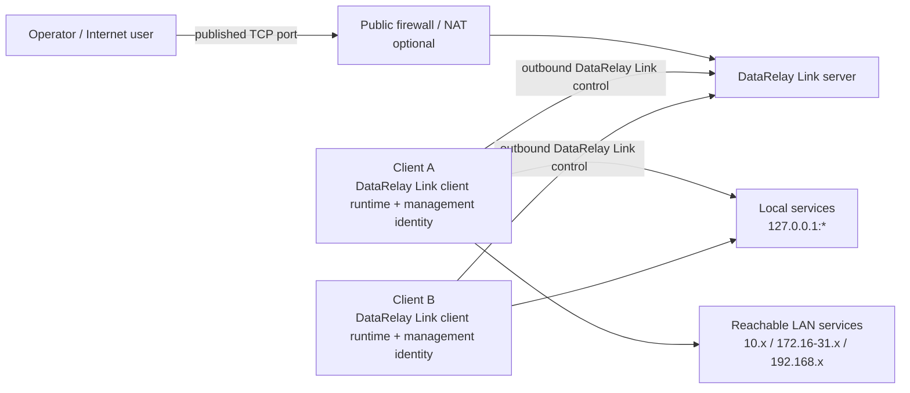
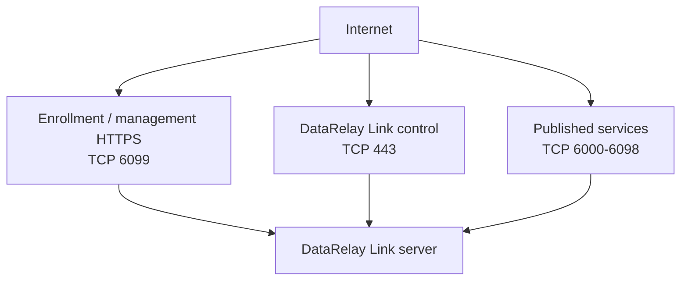
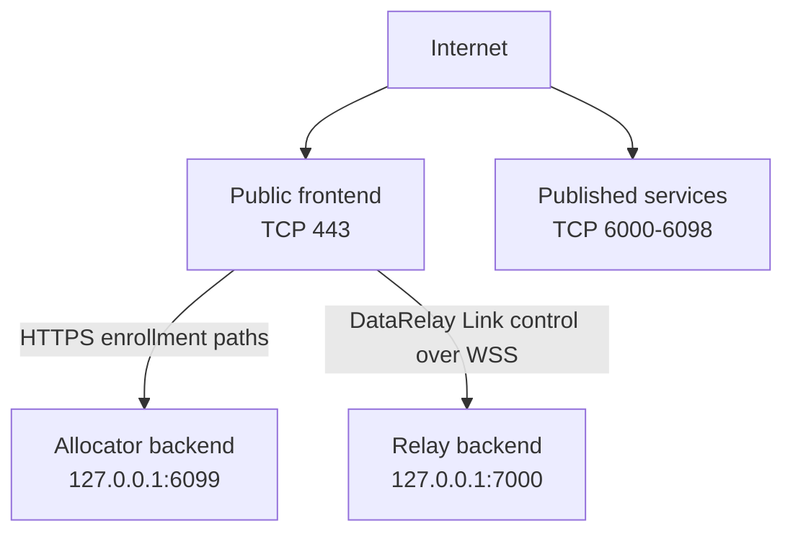
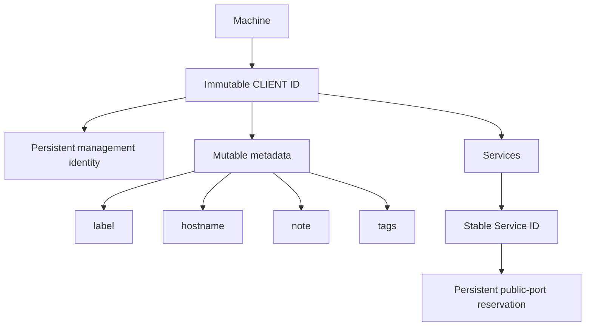
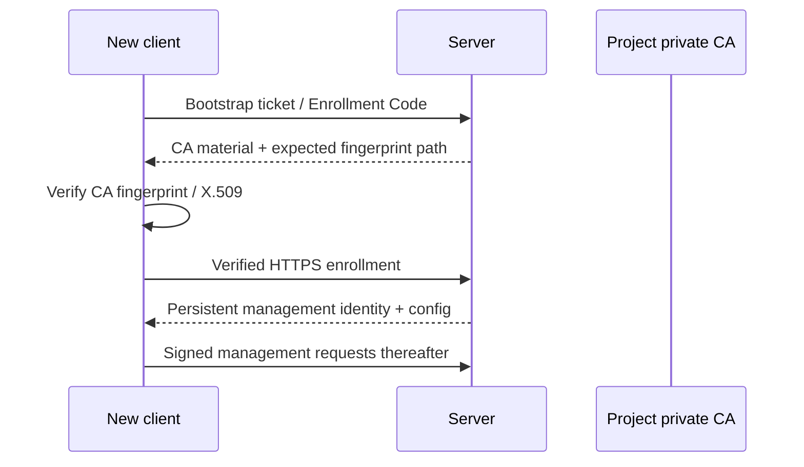

# Architecture

This page is the deeper technical view. For the beginner model, start with [Concepts & Mental Model](/getting-started/concepts).

## System architecture



The product intentionally uses a **bundled relay engine behind the DataRelay Link product layer** rather than exposing low-level transport configuration as the operator experience.

## Control plane vs data plane

| Plane | Purpose | Typical transport |
| --- | --- | --- |
| Enrollment / management | bootstrap trust, identity, service metadata, management actions | verified HTTPS |
| Relay control | register published services and maintain reverse-tunnel control | native relay TLS or WSS |
| Published service data | carry SSH/HTTP/HTTPS/custom TCP | TCP through the relay proxy |

These planes use different credentials and should not be treated as interchangeable.

## Direct mode



Direct is the default deployment mode.

## Enterprise single-443



The backend ports `6099` and `7000` are loopback-only in this mode and should not be Internet-exposed.

## Identity model



The important design rule is that mutable display metadata never becomes canonical identity.

## Trust establishment



The relay token authenticates the relay transport. It is **not** the same credential as the Enrollment Code, Bootstrap Ticket, or client management identity.

## Persistent server state

Important state includes:

```text
/etc/data-relay-link/config.json
/etc/data-relay-link/pki/
/etc/data-relay-link/relay_token
/var/lib/data-relay-link/registry.json
```

The design goal is to preserve identity, CA trust, token, registry, and public-port reservations across normal updates, reboots, and supported restore workflows.

## Fail-closed rules

The management layer should fail rather than guess when it encounters conditions such as:

- unknown or ambiguous client identity
- invalid signatures
- CA mismatch
- inconsistent registry state
- unknown release identity
- unsafe restore/update conditions

## Scale boundary

DataRelay Link is optimized for a few systems to a few dozen clients. It does not aim to become a large-fleet orchestrator, CMDB, endpoint compliance platform, or high-availability management cluster.
