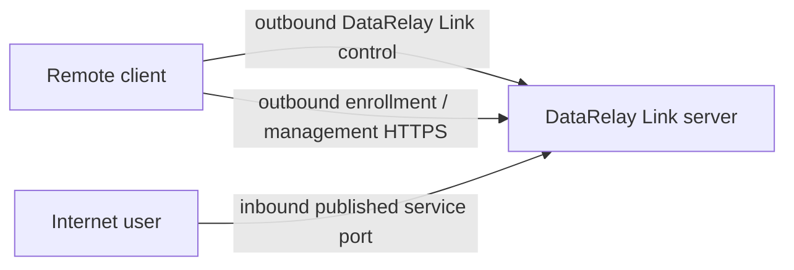
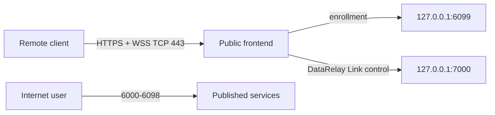

# Network Ports

DataRelay Link publishes **TCP** services. Default published service range: **6000-6098**.

## Port direction at a glance



The remote client normally initiates its connections outbound. The server/public firewall must still accept the required inbound endpoints.

## Direct mode

| Purpose | Who initiates | Default public TCP | Default server listen TCP |
| --- | --- | --: | --: |
| DataRelay Link control | Client → Server | 443 | 443 |
| Enrollment / management HTTPS | Client → Server | 6099 | 6099 |
| Published service | User → Server | 6000-6098 | 6000-6098 |

TCP/22 is optional for your own administrative SSH access to the server and is not part of the DataRelay Link product path.

## Enterprise single-443



| Purpose | Public TCP | Internal/backend TCP |
| --- | ---: | ---: |
| HTTPS enrollment + DataRelay Link control over WSS | 443 | allocator 6099 + relay backend 7000 on loopback |
| Published services | 6000-6098 | 6000-6098 |

<Warning>
  In single-443 mode, allocator backend `6099` and DataRelay Link backend `7000` are not intended to be Internet-exposed.
</Warning>

## NAT deployments

The public control/enrollment ports may be translated by an external firewall.

Example Direct mapping:

```text
Public 8443  -> Server 443
Public 9443  -> Server 6099
Public 6001  -> Server 6001
```

Published service ports should normally stay 1:1 so the persistent DataRelay Link reservation matches the port users actually connect to.

## TCP only

Current stable core scope:

```text
SSH
HTTP
HTTPS passthrough
Custom TCP
```

UDP is not part of the current stable core product scope.
