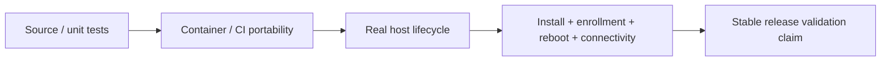

# Supported Platforms

Current published stable release: **DataRelay Link v2.2.1** with bundled/tested relay engine **v0.71.0**.

The v2.2.1 release was qualified with **two complete Real E2E passes on the same exact candidate HEAD**. The candidate and release trees were identical.

## The most important distinction

A **container portability PASS is not the same as a Real E2E validation on an actual host**.

Documentation must not promote a lower-level test into a stronger support claim.

## v2.2.1 stable validation matrix

| Environment | Current stable claim |
| --- | --- |
| Ubuntu 24 physical host | **Real E2E validated** |
| Rocky Linux 8.10 real host | **Real E2E validated** |
| Rocky Linux 9.4 real host | **Real E2E validated** |
| Amazon Linux 2023 real host | **Real E2E validated** |
| macOS Apple Silicon | **Real E2E validated** — launchd, lifecycle, reboot/autostart, CLI/PTTY coverage |
| Windows 10 / PowerShell 5.1 | **Real E2E validated** — SYSTEM task, lifecycle, reboot/autostart |
| Amazon Linux 2 | **Container / CI portability only** — no live-host Real E2E claim |
| PowerShell 7 | **CI validated** — same-host Real E2E is claimed only when `pwsh` is actually installed |

<Note>
  Amazon Linux 2 and PowerShell 7 are intentionally shown with narrower claims. v2.2.1 does **not** claim a live AL2 Real E2E result or a same-host PS7 result on a machine where `pwsh` was absent.
</Note>

## Additional automated portability coverage

The Linux userspace/container matrix also exercises distributions such as Ubuntu 22.04/24.04, Rocky Linux 8/9, AlmaLinux 9, Amazon Linux 2023, and Amazon Linux 2. This is useful compatibility evidence, but it remains distinct from the Real E2E matrix above.

## What Real E2E covered

Across the applicable real platforms, release qualification exercised the product path rather than only process startup. Coverage included, as applicable:

- install / Zero-Touch enrollment
- persistent CLIENT ID and service identity
- SSH and HTTP connectivity
- internal LAN target publishing
- service lifecycle and public-port preservation
- sync/reconcile
- update preservation
- reboot/autostart
- backup/restore and the **Manual Group MVP (manual groups only)** on the qualified release path

## Server scope

The DataRelay Link **server is Linux-based**. macOS and Windows are supported client platforms; a Windows DataRelay Link server remains outside the current product scope.

## Environments that still deserve separate validation

A validated OS family does not mean every variant or security posture has been tested. Treat these as separate environment gates when they matter to your deployment:

- SELinux Enforcing combinations not represented by the qualified host
- native ARM64 systemd environments not represented by a real-host gate
- older OpenSSL/system-library combinations
- unusual firewall/DNAT translations
- enterprise TLS interception/reset behavior

Use `sudo drlink doctor` when validating a new environment.

## Product scale

Platform support does not change the intended management scale: **approximately 1–50 clients**, especially a few systems to a few dozen. DataRelay Link is not a hundreds/thousands-endpoint fleet-orchestration platform.
