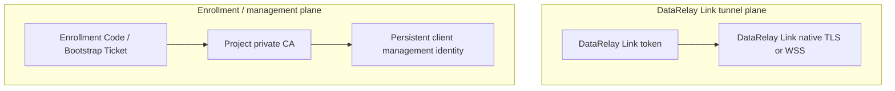
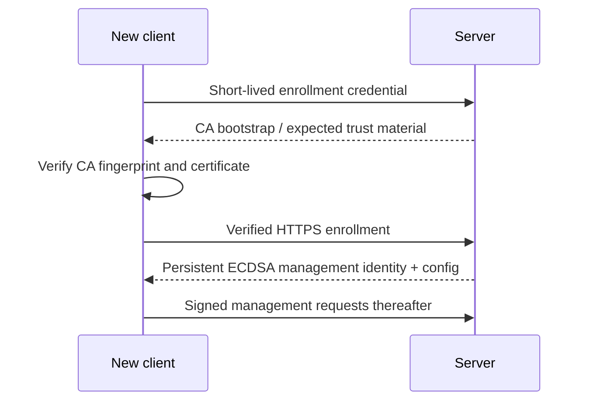
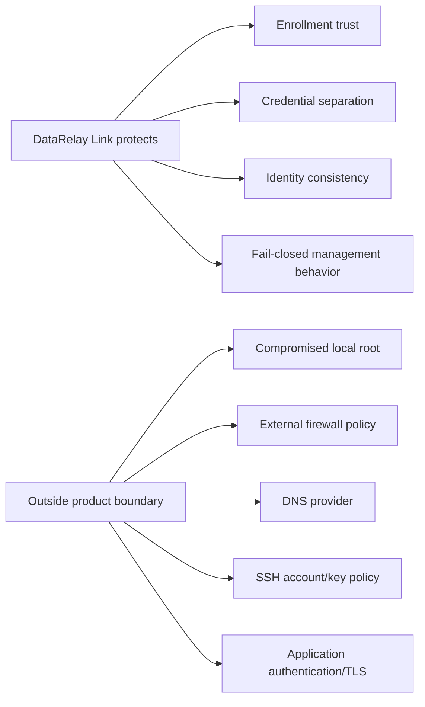

# Security Overview

DataRelay Link separates **DataRelay Link tunnel authentication** from **management-plane trust**. Keeping those responsibilities separate is important when troubleshooting or reviewing risk.

## Security model at a glance

The DataRelay Link token is **not** an Enrollment Code, Bootstrap Ticket, or management API credential.

## Trust establishment

Enrollment and signed client management use verified HTTPS. There is no supported production plain-HTTP fallback.

## DataRelay Link tunnel plane

- Direct mode uses DataRelay Link native TLS for control.
- Enterprise single-443 carries DataRelay Link control over WSS.
- The DataRelay Link token authenticates the tunnel.
- Published service traffic is forwarded through DataRelay Link after the proxy is registered.

## Persistent management identity

After enrollment, the client keeps a persistent ECDSA P-256 management identity. The private key stays on the client.

Signed management requests bind request data to freshness/replay protections such as timestamp/nonce handling so stale or replayed requests can be rejected.

## Zero-Touch credential properties

A Bootstrap Ticket is designed to be:

- high entropy
- short-lived
- first-machine bound
- single-use after successful enrollment
- hashed at rest on the server
- sensitive until used, expired, or revoked

Do not paste generated bootstrap commands into public issue trackers, public chat, analytics, or long-lived logs.

## Secrets to protect

| Secret | Why it matters |
| --- | --- |
| DataRelay Link server token | authenticates DataRelay Link tunnel clients |
| Enrollment Code | first-time manual enrollment secret |
| Bootstrap Ticket | first-time Zero-Touch secret |
| Client management private key | persistent management identity |
| Management MAC material | management request authentication |
| CA private key | project management trust root |
| TLS private key | server-side TLS identity where applicable |
| Generated DataRelay Link config containing token | can expose tunnel credential |

## Security boundaries

The product does not claim to protect secrets from a fully compromised root account on the server or client.

## Published stable access-control boundary

The current published stable release is **v2.2.1**. In that release, DataRelay Link does **not** provide a built-in per-service source-IP allowlist policy or an application-style RBAC layer for published TCP services.

For v2.2.1, restrict who can reach a published service with the controls that own that boundary, such as the external firewall/security group, target-host ACLs, SSH keys/accounts, database ACLs, or the target application's own authentication and authorization.

<Note>
  The product `main` / release-preparation tree contains later Access Control Pack work, but that must not be treated as part of the published stable contract until a release containing it is actually tagged and published.
</Note>

## Fail closed

Conditions such as unknown identity, invalid signatures, CA mismatch, corrupted registry state, or ambiguous client selectors should fail rather than silently guess.

<Warning>
  Do not "fix" trust failures by using `curl -k`, disabling TLS verification, using plain HTTP enrollment, or copying secrets between clients.
</Warning>

## Related pages

- [Architecture](/reference/architecture)
- [Zero-Touch Enrollment](/guides/zero-touch)
- [Lifecycle Semantics](/operations/lifecycle)
- [Backup & Restore](/operations/backup-restore)
