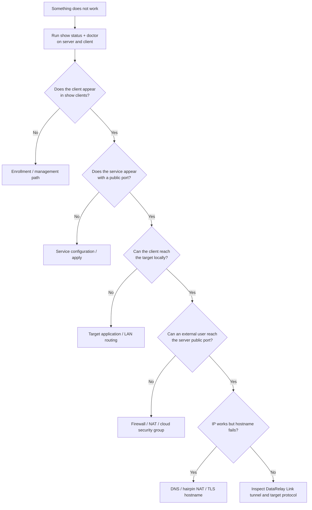
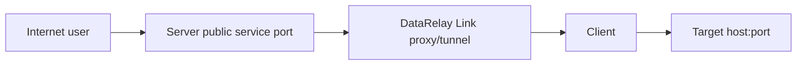
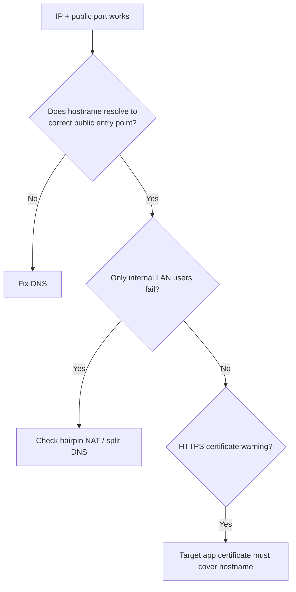

# Troubleshooting

Start with **read-only evidence**, not manual config edits.

## The first decision tree



## 1. Collect the minimum evidence

### Server

```bash
sudo drlink show version
sudo drlink show status
sudo drlink show clients
sudo drlink show enrollments
sudo drlink doctor
```

### Client

```bash
sudo drlink show version
sudo drlink show status
sudo drlink show services
sudo drlink show info
sudo drlink doctor
```

<Note>
  `doctor` is read-only. Run it before editing generated DataRelay Link config, registry, identity, or PKI files.
</Note>

## Symptom: new client is missing on the server

Check in this order:

1. Was the generated Zero-Touch command run exactly as printed?
2. Is the bootstrap/Enrollment Code still valid?
3. Can the client reach the configured **public enrollment HTTPS endpoint**?
4. Is the client's clock badly wrong?
5. Is TLS trust/certificate verification succeeding?
6. Is the client using a public endpoint rather than the server's private address from another network?

For Direct defaults, the client typically needs outbound access to TCP `443` and `6099`.

## Symptom: client exists, but SSH/web service is unreachable

Trace every hop:



Verify:

- `show client <ID> services` shows the expected public port
- external firewall/cloud security policy allows that public service port
- the client has a healthy DataRelay Link state
- the target host/port is reachable **from the client**
- the target application is actually listening

For client-local SSH, a useful local check is:

```bash
ss -lntp | grep ':22'
```

## Symptom: LAN target does not work

The DataRelay Link client must be able to reach the LAN target without DataRelay Link first.

```text
Client -> 10.10.20.30:22
```

If that direct path fails, fix routing, ACL, host firewall, service binding, or application state before changing DataRelay Link.

## Symptom: TCP connects but TLS resets

Some enterprise networks permit a TCP handshake on a non-standard port but reset TLS traffic there.

Do **not** work around this with `curl -k`, plain HTTP enrollment, or disabled TLS verification.

Review [Deployment Modes](/deployment/modes) and consider Enterprise single-443 when that network behavior is confirmed.

## Symptom: IP works, hostname fails



DataRelay Link uses the hostname but does not create DNS records.

## Symptom: HTTPS certificate warning

Published HTTPS is TCP passthrough. The browser sees the **target application's** certificate, not a certificate generated by DataRelay Link.

If users enter `https://fw.example.com:6005`, the target application certificate must be appropriate for `fw.example.com`.

## Symptom: server is behind NAT

For a private DataRelay Link server, verify the public-to-private mapping explicitly:

```text
public control       -> DataRelay Link control listen port
public enrollment    -> allocator/enrollment listen port
public service port  -> same DataRelay Link service port (recommended 1:1)
```

See [Firewall & NAT](/deployment/firewall-nat).

## What not to do first

- do not delete/recreate the client just because a service port is unreachable
- do not release ports when you only mean to temporarily disable a service
- do not replace verified HTTPS with plain HTTP
- do not use `curl -k` as a production fix
- do not copy secret files manually between clients
- do not edit registry/identity/PKI files without a documented recovery procedure

## Escalation checklist

If the problem remains, collect:

- server/client `show version`
- server/client `show status`
- relevant `doctor` output
- deployment mode
- public vs internal port mapping
- CLIENT ID and Service ID (not enrollment secrets)
- exact target host/port
- whether IP access works and whether DNS-only access fails
- whether the target works locally from the client
